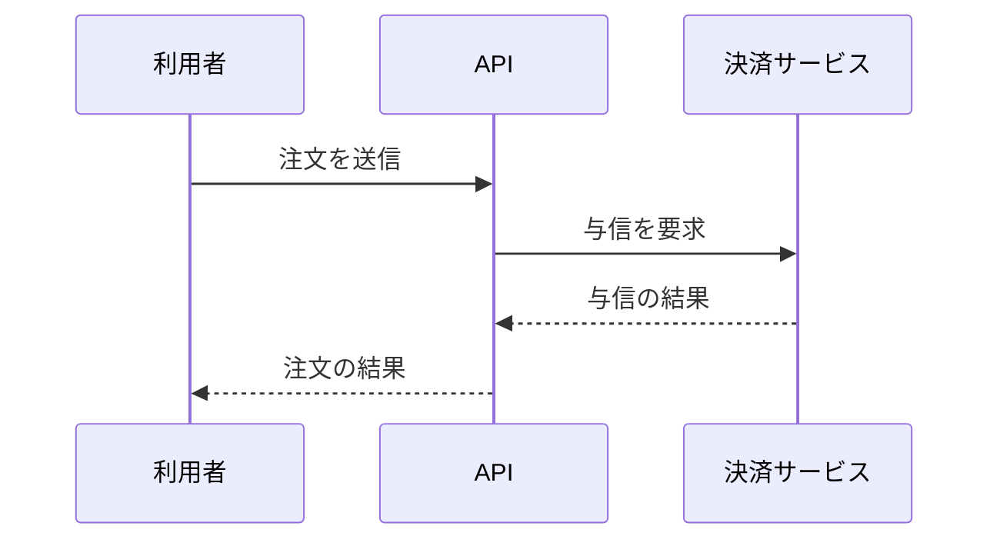
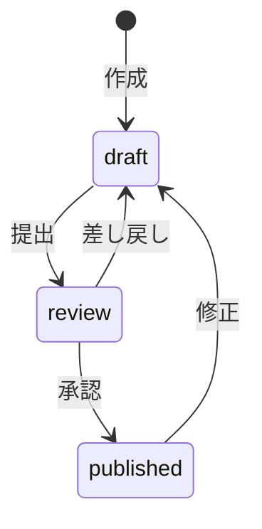

# 図の描き方

ASCII 図で迷ったときと、Mermaid を使うときに読む。

## 図の種類を選ぶ

| 伝えたいこと                     | 図の形                   | 描き方                                            |
| -------------------------------- | ------------------------ | ------------------------------------------------- |
| 作業の順序と分岐                 | 縦のフロー               | ASCII                                             |
| 構成要素のつながり               | 箱と矢印                 | ASCII。要素が 10 個を超えたら Mermaid             |
| 階層・包含（環境、ディレクトリ） | ツリー                   | ASCII                                             |
| 3 者以上のやり取りの順序         | シーケンス図             | Mermaid                                           |
| 状態の変化                       | 状態遷移                 | 戻る矢印が 1 本までなら ASCII、それ以上は Mermaid |
| 時刻ごとの出来事                 | 図にせず、時刻と事実の表 | 表                                                |

## ASCII 図

### 共通のルール

- 言語指定 `text` のコードブロックに入れる。
- 使う記号は `─ │ ┌ ┐ └ ┘ ├ ┤ ┬ ┴ ┼ ▶ ◀ ▲ ▼` にする。
- 日本語を含む要素は `[名前]` で囲み、右側を罫線で閉じない。
- 縦にそろえる記号（`│ ▼ ▲ ┐ ┘ ┤ ┬ ┴ ┼` など）は、その行で左側に日本語（全角文字）がない位置に置く。幹を左端に置き、枝を右へ伸ばす。
- 矢印の意味が自明でなければ、線の途中か矢印の横にラベルを書く（`──失敗──▶`、`│ 成功`）。
- 読む方向は上から下か左から右の一方にそろえる。要素の順序と名前は、本文の見出しと一致させる。
- 1 枚は 15 行、要素 10 個程度までにする。超える場合は全体図と詳細図に分けるか、Mermaid にする。
- 図の中に説明文を書き込まない。説明は本文に書く。

### 縦のフロー（順序と分岐）

```text
[1. バックアップを取る]
        │
        ▼
[2. 移行する] ──失敗──▶ [切り戻し手順へ]
        │ 成功
        ▼
[3. 動作を確かめる]
```

分岐が 2 段以上になる場合は、分岐先ごとに詳細図を分ける。

### 箱と矢印（構成要素のつながり）

```text
[ブラウザ]
    │ HTTPS
    ▼
[API サーバー] ──SQL──▶ [PostgreSQL]
    │
    │ ジョブを登録
    ▼
[ワーカー] ──画像を保存──▶ [S3]
```

要素の名前がすべて半角文字なら、罫線で閉じた箱を使ってよい。

```text
┌─────────┐      ┌─────────┐      ┌──────────┐
│ browser │ ───▶ │ api     │ ───▶ │ postgres │
└─────────┘      └─────────┘      └──────────┘
```

### ツリー（階層・包含）

```text
本番環境
├── prod-vpc
│   ├── public サブネット: ALB
│   └── private サブネット: ECS サービス、RDS
└── S3 バケット: prod-assets
```

### 状態遷移（戻る矢印が 1 本まで）

```text
[下書き]
    │ 提出
    ▼
[レビュー中] ──差し戻し──▶ [下書き] へ戻る
    │ 承認
    ▼
[公開]
```

## Mermaid

- 次の図に使う。
  - 要素がおよそ 10 個を超える図
  - 線が交差する図
  - 3 者以上のやり取りの順序
  - 戻る矢印が 2 本以上ある状態遷移
- Slack、メール、コミットメッセージなど、Mermaid を表示できない場所では使わない。ASCII 図に収まるよう図を分ける。
- ノード ID は半角英字にし、日本語は表示名に書く。ラベルは短くする。
- 色やスタイルだけで意味を区別しない。
- 描画できる環境があれば、描画して崩れていないことを確かめる。

シーケンス図:



状態遷移:



## 図を確かめる

- 図の要素名と順序が、本文の見出しと一致している。
- すべての矢印の意味が、ラベルか文脈から分かる。
- 縦の記号の左側に日本語がなく、縦の線が途切れたりずれたりしていない。
- 視線が上下左右に行き来せず、一方向に読める。
